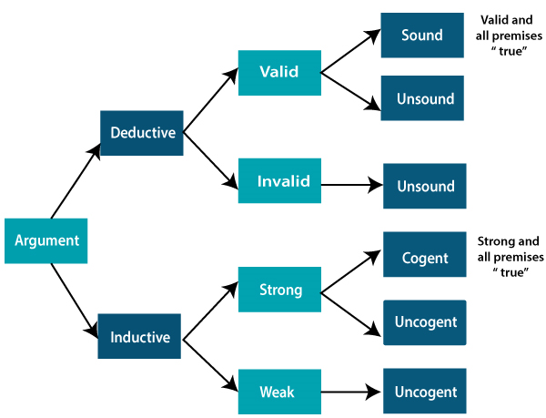

### Difference between Inductive and Deductive Reasoning

Reasoning in artificial intelligence has two important forms, inductive reasoning and deductive reasoning. Both reasoning forms have premises and conclusions, but both reasoning are contradictory to each other. Following is a list for comparison between inductive and deductive reasoning:

- Deductive reassoning uses available facts, information, or knowledge to deduce a valid conclusion, whereas inductive reasoning involves making a generalization from specific facts, and observations.
- Deductive reasoning uses a top-down approach, whereas inductive reasoning uses a bottom-up approach.
- Deductive reasoning moves from generalized statement to a vliad conclusion, whereas inductive reasoning moves from specific obseration to generalisation.
- In deductive reasoning, the conclusions are certain, whereas, in inductive reasoning, the conclusions are probabilistic.
- Deductive arguments can be valid or invalid, which means if premises are true, the conclusion must be true, whereas inductive argument can be strong or weak, which means conclusion may be false even if premises are true.

The differences between inductive and deductive can be explained using the below diagram on the basis of arguments:

### Comparison of Inductive Reasoning and Deductive Reasoning

| **Basis for comparison** | **Deductive Reasoning** | **Inductive Reasoning** |
| ------------------------ | ------------------------ | ----------------------- |
| Definition               | Deductive reasoning is the form of valid reasonin, to deduce new information or conclusion from known related facts and information | Inductive reasoning arraives at a conclusion by the process of generalization using specific facts or data |
| Approach                 | Deductive reasoning follows a top-down approach | Inductive reasoning follows a bottom-up approach |
| Starts from              | Deductive reasoning starts from premises        | Inductive reasoning starts from conclusion       |
| Validity                 | In deductive reasoning conclusion must be true if the premises are true | In inductive reasoning, the truth of premises does not guarantee the truth of conclusions |
| Usage                    | Usage of deductive reasoning is difficult, as we need facts which must be true | Use of inductive reasoning is fast and easy, aswe need evidence instead of true facts. We othen use it in our daily life |
| Process                  | Thoery -> Hypothesis -> Patterns -> Confirmation | Obserations -> Patterns -> Hypothesis --> Theory |
| Argument                 | In deductive reasoning, arguments may be valid or invalid | In inductive reasoning, arguments may be weak or strong |
| Structure                | Deductive reasoning reaches from general facts to specific facts | Inductive reasoning reaches from specific facts to general facts |