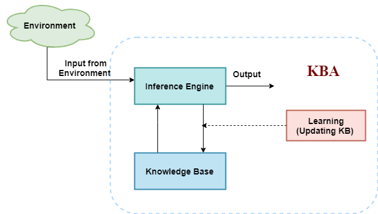

### Knowledge-Based Agent in Artificial Intelligence

An intelligent agent needs knowledge about the real world for taking decisions and reasoning to act efficiently. Knowledge-based agents are those agents who have the capability of maintaining an internal state of knowledge, reason over that knowledge, update their knowledge after observations and take actions. These agents can represent the world with some formal representation and act intelligently.

Knowledge-based agents are composed of two main part:
- Knowledge-base
- Inference system

A knowledge-based agent must able to do the following:
- An agent should be able to represent states, actions, etc.
- An agent should be able to incorporate new percepts
- An agent can update the internal representation of the world
- An agent can deduce the internal representation of the world
- An agent can deduce appropriate actions

### The Architecture of Knowledge-Based Agent



The above diagram is representing a generalized architecture for a knowledge-based agent. The knowledge-based agent (KBA) take input from the environment by perceiving the environment. The input is taken by the inference engine of the agent and which also communicate with KB to decide as per the knowledge store in KB. The learning element of KBA regularly updates the KB by learning new knowledge.

**Knowledge base**: Knowledge-base is a central component of a knowledge-based agent, it is also known as KB. It is a collection of sentences (here 'sentence' is a tehcnical term and it is not identical to sentence in English). These sentences are expressed in a language which is called a knowledge representation language. The knowledge-base of KBA stores fact about the world.

#### Why use a knowledge base?

Knowledge-base is required for updateing knowledge for an agent to learn with experiences and take action as per the knowledge.


### Inference System

Inference means deriving new sentences from old. Inference system allows us to add a new sentence to the knowledge base. A sentence is a proposition about the world. Inference system applies logical rules to the KB to deduce new information.

Inference system generates new facts so that an agent can update the KB. An inference system works mainly in two rules which are given as:
- Forward chaining
- Backward chaining

### Operations Performed by KBA

Following are three operations which are performed by KBA in order to show the intelligent behavior:
- TELL: this operation tells the knowledge base what it perceives from the environment
- ASK: this opeartion asks the knowledge base what action it should perform
- Perform: it performs the selected action

### A generic knowledge-based agent

Following is the structure outline of a generic knowledge-based agents program:
```
function KB-AGENT(percept):
    persistent: KB -> a knowledge base
                t -> a counter, initially 0, indicating time
    TELL(KB, MAKE-PERCEPT-SENTENCE(percept, t))
    ACTION = ASK(KB, MAKE-ACTION-QUERY(t))
    TELL(KB, MAKE-ACTION-SENTENCE(action, t))
    t = t + 1
    
    return ACTION
```

The knowledge-based agent takes percept as input and returns an action as output. The agent maintains the knowledge base, KB, and initially has some background knowledge of the real world. It also has a counter to indicate the time for the whole process, and this counter is initialized with zero.

Each time when the function is called, it performs its three operations:
- TELLs the KB what it perceives
- ASK the KB what action it should take
- TELLs the KB that action was chosen

The MAKE-PERCEPT-SENTENCE generates a sentence as setting that the agent perceived the given percept at the given time.

The MAKE-ACTION-QUERY generates a sentence to ask which action should be done at the current time.

The MAKE-ACTION-SENTENCE generates a sentence which asserts that the chosen action was executed.

### Various levels of Knowledge-Based Agent

A knowledge-based agent can be viewed at different levels which are given below:
1. Knowledge level
    
    Knowledge level is teh first level of knowledge-based agent, and in this level, we need to specify what the agent knows, and what the agent goals are. With these specifications, we can fix its behavior. For example, suppose automated taxi agent needs to go from a station A to station B, and he knows the way from A to B, so this comes at the knowledge level.
    
2. Logical level

    At this level, we understand that how the knowledge representation of knowledge is stored. At this level, sentences are encoded into different logics. At the logical level, an encoding of knowledge into logical sentenses occurs. At the logical level we can expect to the automated taxi agent to reach the destination B.

3. Implmentation level

    This is the physical representation of logic and knowledge. At the implementation level agent perform actions as per logical and knowledge level. At this level, an automated taxi agent acutally implement his knowledge and logic so that he can reach to the destination.
    
### Approaches to Designing a Knowledg-Based Agent

There are mainly two approaches to build a knowledge-based agent:
- Declarative approach
    
    We can create a knowledge-based agent by initializing with an empty knowledge base and telling the agent all the sentences with which we want to start with. This approach is called Declarative approach.
    
- Procedural approach

    In the procedural approach, we directly encode desired behavior as a program code. Which means we just need to write a program that already encodes the desired behavior or agent.

However, in the real world, a successful agent can be built by combing both declarative and procedural approaches, and declarative agent can be built by combining both declarative and procedural approaches, and declarative knowledge can often be compiled into more efficient procedural code.