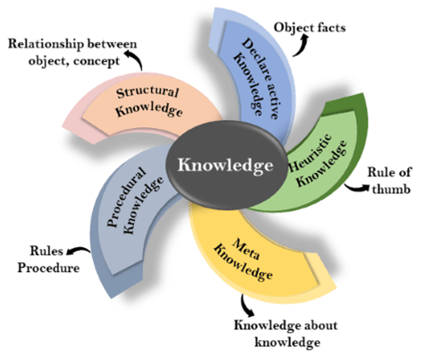

### Knowledge Representation

An intelligent agent needs knowledge about the real world for taking decisions and reasoning to act efficiently. Knowledge-based agents are those agents who have the capability of maintaining an internal state of knowledge, reason over that knowledge, update their knowledge after observations and take actions. These agents can represent the world with some formal representation and act intelligently.

Knowledge-based agents are composed of two main part:
- Knowledge-base
- Inference system

A knowledge-based agent must able to do the following:
- An agent should be able to represent states, actions, etc.
- An agent should be able to incorporate new percepts
- An agent can update the internal representation of the world
- An agent can deduce the internal representation of the world
- An agent can deduce appropriate actions

### What is Represent

Following are the kind of knowledge which needs to be represented in AI systems:
- Object: all the facts about objects in our world domain. e.g. guitars contain strings, trumpet are brass instruments.
- Events: events are the actions which occur in our world.
- Performance: It describe behavior which involves knowledge about how to do things.
- Meta-knowledge: It is knowledge about what we know.
- Facts: Facts are the truths about the real world and what we represent.
- Knowledge-Base: The central component of the knowledge-based agents is the knowledge base. It is represented as KB. The Knowledgebase is a group of the sentences.

### Types of Knowledge

Knowledge: Knowledge is awareness of familiarity gained by experiences of facts, data, and situations. Following are the types of knowledge in aritificial intelligence.
- **Declarative Knowledge**:
    - Declarative knowledge is to know about something.
    - It includes concepts, facts, and objects.
    - It is also called descriptive knowledge and expressed in declarative sentences.
    - It is simpler than procedural language.
- **Procedual Knowledge**:
    - It is also known as imperative knowledge.
    - Procedural knowledge is a type of knowledge which is responsible for knowing how to do something.
    - It can be directly applied to any task.
    - It includes rules, strategies, procedures, agendas, etc.
    - Procedural knowledge depends on the task on which it can be applied.
- **Meta Knowledge**:
    - Knowledge about the other types of knowledge is called meta-knowledge.
- **Heuristic Knowledge**:
    - Heuristic knowledge is representing knowledge of some experts in a field or subject.
    - Heuristic knowledge is rules of thumb based on previous experiences, awareness of approaches, and which are good to work but not guaranteed.
- **Structural Knowledge**:
    - Structual knowledge is basic knowledge to problem-solving
    - It describes relationships between various concepts such as kind of, part of, and grouping of something.
    - It describes the relationship that exists between concepts or objects.

### Approaches to Knowledge Representation
Thare are mainly four approahces to knowledge representation, which are given below:
- Simple relational knowledge
    - It is the simplest way of storing facts which uses the relational method, and each fact about a set of the object is set out systematically in columns.
    - This approach of knowledge representation is famous in databse systems where the relationship between different entities is represented.
    - This approach has little opportunity for inference.
- Inheritable knowledge
    - In the inheritable knowledge approach, all data must be stored into a hierarchy of classes.
    - All classes should be arranged in a generalized form of a hierarchal manner.
    - In this approach, we apply inheritance property.
    - Elements inherit values from other memebers of a class.
    - This approach contains inhertiable knowledge which shows a relation between instance and class, and it is called instance relation.
    - Every individual frame can represent the colleciton of attributes and its value.
- Inferential knowledge
    - Inferential knoweldge approach represents knowledge in the form of formal logics.
    - This approach can be used to derive more facts.
    - It guaranteed correctness.
- Procedural knowledge
    - Procedual knowledge approach uses small program and codes which describes how to do specific things and how to proceed.
    - In this approach, one important rule is used which is *If-Then rule*.
    - In this knowledge, we can use various coding languages such as LISP language or Prolog language.
    - We can easily represent heuristic or domain-specific knowledge using this approach.
    - But it is not necessary that we can represent all cases in this approach.
    
### Requirements for Knowledge Representation System
A good knowledge representaiton system must possess the following properties:
- Representational Accuracy: KR system should have the ability to represent all kind of required knowledge.
- Inferential Adequacy: KR system should have ability to manipulate the representational structures to produce new knowledge corresponding to exisitng structure.
- Inferential Efficiency: The ability to direct the inferential knowledge mechanism into the most productive directions by storing appropriate guides.
- Acquisitional efficiency: The ability to acquire the new knowledge easily using automatic methods.