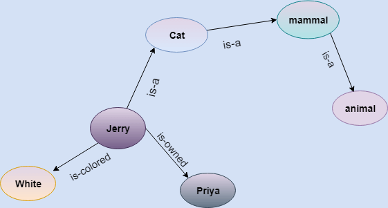

### Techniques of Knowledge Representation

There are mainly four ways of knowledge representation which are given as follows:
- [Logical representaiton](#logical-representation)
- [Semantic Network Representation](#semantic-network-representation)
- [Frame Representation](#frame-representation)
- [Production Rules](#production-rules)

### Logical Representation    

Logical representation is a language with come concrete rules which deals with propositions and has no ambiguity in representation. Logical representation means drawing a conclusion based on various conditions. This representation lays down some important communication rules. It consists of precisely defined syntax and semantics which supports the sound inference. Each sentence can be translated into logics using syntax and semantics.

#### Syntax
- Synatxes are the rules which describe how we can construct legal sentences in the logic.
- It determines which symbol we can use in knowledge representation.
- How to write those symboles.

Logical representation can be categorised into mainly two logics:
- Propositional logic
- Predicate logic

#### Semantics
- Semantics are the rules by which we can interpret the sentence in the logic.
- Semantics also invovle assigning a meaning to each sentence.

| Advantages of Logical Representation | Disadvantages of Logical Representation |
| ---- | ---- |
| Logical representation enables us to do logical reasoning | Logical representations have some restrictions and are challenging to work with |
| Logical representation is the basis for the programming languages | Logical representation technique may not be very natrual, and inference may not be so efficient |

> Do not be confused with logical representation and logical reasoning as logical representation is a representation language and reasoning is a process of thinking logically.

### Semantic Network Representation

Semantic networks are alternative of predictive logic for knowledge representation. In semantic networks, we can represent our knowledge in the form of graphic networks. This network consists of nodes representing objects and arcs which describe the relationship between those objects. Semantic networks can categorize the object in different forms and can also link those objects. Semantic networks are easy to understand and can be easily extended.

This representation consist of mainly two types of relations:
- IS-A relation (inhertiance)
- Kind-of-relation

In the above diagram, we have represented the different type of knowledge in the form of nodes and arcs. Each object is connected with another object by some relation.

| Advantages of Semantic Network Representation | Disadvantages of Semantic Network Representation |
| ---- | ---- |
| Semantic networks are a natural representation of knowledge | Semantic networks take more computational time at runtime as we need to traverse the complete network tree to answer some questions. It might be possible in the worst case scenario that after traversing the entire tree, we find that the solution does not exist in this network |
| Semantic networks convey meaning in a transparent manner | Semantic networks tyr to model human-like memory to store the information, but in practice, it is not possible to build such a vast semantic network |
| These networks are simple and easily understandable | These types of representation are inadequate as they do not have any equivalent quantifier |
| | Semantic networks do not have any standard definition for the link names |
| | These networks are not intelligent and depend on the creator of the system |

### Frame Representation

A frame is a record like structure which consists of a collection of attributes and its values to describe an entity in the world. Frames are the AI data structure which devidies knowledge into substructures by representing stereotypes situations. It consists of a collection of slots an slot values. These slots may be any type and sizes. Slots have names and values which are called facets.

**Facets**: The various aspects of a slot is known as facets. Facets are features of frames which enable us to put constraints on the frames. For example, IF-NEEDED facts are called when data of any particular slot is needed. A frame may consist of any number of slots, and a slot may include any number of facets and facets may have any number of values. A frame is also known as slot-filter knowledge representation in artificial intelligence.

Frames are derived from semanticc networks and later envolved into our modern-day classes and objects. A single frame is not much useful. Frames system consist of a collection of frames which are connected. In the frame, knowledge about an object or event can be stored together in the knowledge base. The frame is a type of technology which is widely used in various applications including Natural Language Processing and machine visions.

| Advantages of Frame Representation | Disadvantages of Frame Representation |
| ---- | ---- |
| The frame knowledge represtation makes the programming easier by grouping the related data | In frame system inference mechanism is not be easily proceed |
| The frame representation is comparably flexible and used by many applications in AI | Inference mechanism cannot be smoothly proceeded by frame representation |
| It is very easy to add slots for new attribute and relations | Frame representation has a much generalized approach |
| It is easy to include default data and to search for missing values | | 
| Frame representation is easy to understand and visualize | |

### Production Rule
Production rules system consist of (condition, action) pairs which mean "If condition then action". It ahs mainly three parts:
- The set of production rules
- Working Memory
- The recognize-act-cycle

In production rules agent checks for the condition and if the condition exists then production rule fires and corresponding action is carried out. The condition part of the rule determines which rule may be applied to a program. An the action part carries out the associated problem-solving steps. This complete process is called a recoginize-act cycle.

The working memory contains the description of the current state of problems-solving and rule can write knowledge to the working memory. This knowledge match and may fire other rules.

If there is a new situation (state) generates, then multiple production rules willl be fired together, this is called conflict set. In this situation, the agent needs to select a rule from these sets, and it is called a conflict resolution.

| Advantages of Production Rule | Disadvantages of Production Rule |
| ---- | ---- |
| The production rules are expressed in natural language | Production rule system does not exhbit any learning capabilities, as it does not store the result of the problem |
| The production rules are highly modualr, so we can easily remove, add or modify an individual one | During the execution of the program, many rules may be active hence rule-based production systems are inefficient |

