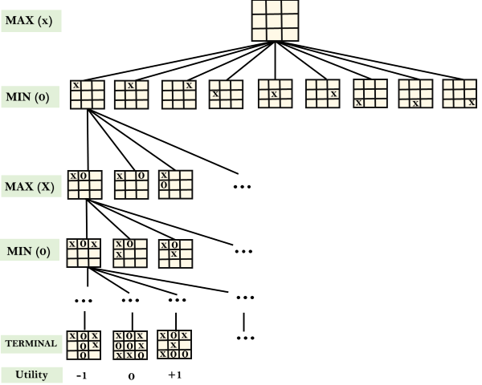
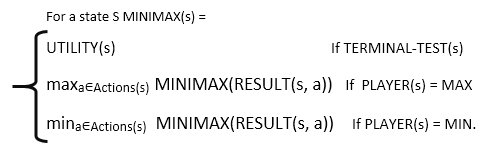

### Adversarial Search

Adversarial search is a search, where we examine the problem which arises when we try to plan ahead of the world and other agents are planning against us.

### Types of Game in AI

|                       | Deterministic                       | Chance Moves                               |
| --------------------- | ----------------------------------- | ------------------------------------------ |
| Perfect Information   | Chess Checkers go Othello  | Backgammon Monoploy                     |
| Imperfect Information | Battleships Blind Tic-Tac-Toe | Bridge Poker Scrabble Nuclear war |

**Perfect Information**: A game with the perfect information is that in which agents can look into the complete board. Agents have all information about the game, and they can see each other moves also.

**Imperfect Information**: If in a game agents do not have all information about the game and not aware with what's going on, such type of games are called the game with imperfect information.

**Determinsitc games**: Determinsitic games are those games which follow a strict pattern and set of rules for the games, and there is no randomness associated with them. 

**Non-deterministic games**: Non-deterministic are those games which have various unpredictable events and has a factor of change or luck. This factor of change or luck is introduced by either dice or cards. These are random, and each action response is not fixed. Such games are also called as stochastic games.

### Zero-sum Game

Zero-sum games are adversial search which involves pure competition. In zero-sum game each agent's gain or loss of utility is exactly balanced by the losses or gains of utility of another agent. One player of the game try to maximize one single value, while other player tries to minimize it. Each move by one player in the game is called as ply. Chess and tic-tac-toe are examples of a zero-sum game.

#### Zero-sum game: embeded thinking

The zero-sum game involved embeded thinking in which one agent or player is trying to figure out:
- What to do?
- How to decide the move?
- Needs to think about his opponent as well.
- The opponent also thinks what to do.

Each of players is trying to find out the reponse of his opponent to their actions. This requires embedded thinking or backwar reasoning to solve the game problems in AI.

#### Formalization of the problem:

A game can be defined as a type of search in AI which can be formalized of the following elements:
- Initial state: it specifies how the game is set up at start
- Player(s): it specifies which player has moved in the state space
- Action(s): it returns the set of legal moves in state space
- Result(s, a): it is the transition model, which specifies the result of moves in the state space
- Terminal-Test(s): terminal test is true if the game is over, else it is false at any case. The state where the game ends is called terminal states.
- Utility(s, p): A utility function gives the final numeric value for a game that ends in terminal states for player p. It is also called payoff function. For Chess, the outcomes are a win, loss, or draw and its payoff values are +1, 0, 1/2. And for tic-tac-toe, utility values are +1, -1, and 0.

### Game tree:

A game tree is a tree where nodes of the tree are the game states and edges of the tree are the moves by players. Game tree involves initial state, actions function, and result function.

#### E.g. Tic-Tac-Toe

The following figure is showing part of the game-tree for tic-tac-toe game. Followin are some key points of the game:
- There are two players MAX and MIN
- Players have alternate turn and start with MAX
- MAX maximizes the result of the game tree
- MIN mimizes the reuslt of the game tree

**Example Explanation**

- From the initial state, MAX has 9 possible moves as he starts first. MAX place x and MIN place o, and both player plays alternatively until we reach a leaf node where one player has three in a row or all squares are filled.
- Both players will compute each node, minimax, the minimax value which is the best achievable utility against an optimal adversary.
- Suppose both the players are well aware of the tic-tac-toe and playing the best play. Each player is doing his best to prevent another one from winning. MIN is acting against Max in the game.
- So in the game tree, we have a layer of Max, a layer of MIN, and each layer is called as Ply. Max place x, then MIN puts o to prevent Max from winning, and this game continues until the terminal node.
- In this either MIN wins, MAX wins, or it's a draw. This game-tree is the whole search space of possibilities that MIN and MAX are playing tic-tac-toe and taking turns alternately.

Hence adversarial Search for the minimax procedure works as follows:

- It aims to find the optimal strategy for MAX to win the game.
- It follows the approach of Depth-first search.
- In the game tree, optimal leaf node could appear at any depth of the tree.
- Propagate the minimax values up to the tree until the terminal node discovered.

In a given game tree, the optimal strategy can be determined from the minimax value of each node, which can be written as MINIMAX(n). MAX prefer to move to a state of maximum value and MIN prefer to move to a state of minimum value then:

