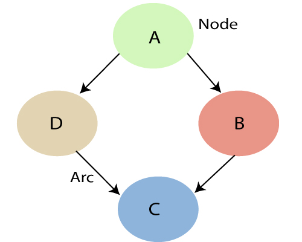
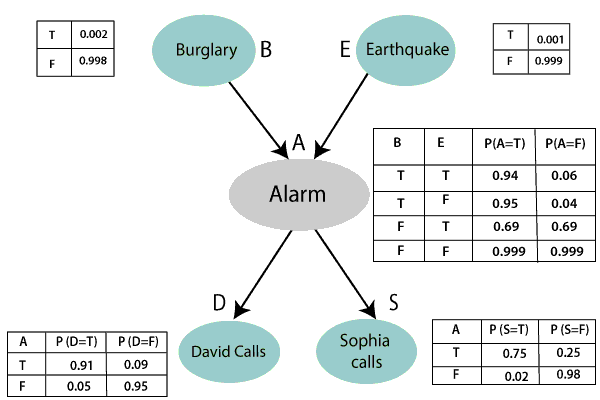

### Bayesian Belief Network in Aritificial Intelligence

Bayesian belief network is key computer technology for dealing with probabilistic events and to solve a problem which has uncertainty. We can define a Bayesian network as: "A Bayesian network is a probablisitic graphical model which represents a set of variables and their conditional dependences using a directed acyclic graph". It is also called a Bayes network, belief network, decision network, or Bayesian model.

Bayesian networks are probabilistic, because these networks are built from a probablity distribution, and also use probability theory for prediction and anomaly detection. Real world applications are probablistic in nature, and to represent the relationship between mutiple events, we need a Bayesian network. It can also be used in various tasks including prediction, anomaly detection, diagnositcs, automated insight, reasoning, time series prediction, and decision making under uncertainty.

Bayesian network can be used for building modesl from data and experts opinions, and it consists of two parts:
- Directed Acyclic Graph
- Table of Conditional Probabilities

The generalized form of Bayesian network that represents and solve decision problems under uncertain knowledge is known as an influence diagram.

A Bayesian network graph is made up of nodes and Arcs (directed links), where:



- Each node correspond to the random variables and a variable can be continuous or discrete.
- Arc or directed arrows represent the causual relationship or conditional probabilities between random variables. These directed links or arrows connect the pair of nodes in the graph. These links represent that one node directly influence the other node, and if there is no directed link that means that nodes are indepedent with each other.
    - In the above diagram, A, B, C, and D are random variables represented by the nodes of the network graph.
    - If we are considering node B, which is connected with node A by a directed arrow, then node A is called the parent of Node B.
    - Node C is independent of node A.
    
> The Bayesian network graph does not contain any cyclic graph. Hence it is known as a directed acyclic graph of DAG.

The Bayesian network has mainly two components:
- Causual component
- Actual numbers

Each node in the Bayesian network has condition probability distribution P(X_i|Parent(X_i)), which determines the effect of the parent on that node.

Bayesian network is based on Joint probablity distribution and conditional probability. So let's first understand the joint probability distribution.

#### Joint Probability Distribution

If we have variables x1, x2, x3,....., xn, then the probabilities of a different combination of x1, x2, x3.. xn, are known as Joint probability distribution.

P[x1, x2, x3,....., xn], it can be written as the following way in terms of the joint probability distribution.

= P[x1| x2, x3,....., xn]P[x2, x3,....., xn]

= P[x1| x2, x3,....., xn]P[x2|x3,....., xn]....P[xn-1|xn]P[xn].

In general for each variable Xi, we can write the equation as: P(X_i|X_{i-1}, ..., X_1) = P(X_i|Parents(X_i)).

#### Explanation of Bayesian network

Let's understand the Bayesian network through an example by creating a directed acyclic graph:

**Example**: Harry installed a new burglar alarm at his home to detect burglary. The alarm reliably responds at detecting a burglary but also responds for minor earthquakes. Harry has two neighbors David and Sophia, who have taken a responsibility to inform Harry at work when they hear the alarm. David always calls Harry when he hears the alarm, but sometimes he got confused with the phone ringing and calls at that time too. On the other hand, Sophia likes to listen to high music, so sometimes she misses to hear the alarm. Here we would like to compute the probability of Burglary Alarm.

**Problem**: Calculate the probability that alarm has sounded, but there is neither a burglary, nor an earthquake occurred, and David and Sophia both called the Harry.

**Solution**:
- The Bayesian network for the above problem is given below. The network structure is showing that burglary and earthquake is the parent node of the alarm and directly affecting the probability of alarm's going off, but David and Sophia's calls depend on alarm probability.
- The network is representing that our assumptions do not directly perceive the burglary and also do not notice the minor earthquake, and they also not confer before calling.
- The condition distributions for each node are given as conditional probabilities tbale or CPT.
- Each row in the CPT must be sum to 1 because all the entries in the table represent an exhaustive set of cases for the variable.



List of all events occuring in this network:
- Burglary (B)
- Earthquake (E)
- Alarm (A)
- David Calls (D)
- Sophia Calls (S)

We can write the events of problem statement in the form of probability: P[D, S, A, B, E], can rewrite the above probability statement using joint probability distribution:
```
P[D,S,A,B,E] = P[D|S,A,B,E] * P[S,A,B,E]
             = P[D|S,A,B,E] * P[S|A,B,E] * P[A,B,E]
             = P[D|S,A,B,E] * P[S|A,B,E] * P[A|B,E] * P[B,E]
             = P[D|S,A,B,E] * P[S|A,B,E] * P[A|B,E] * P[B|E] * P[E]
```

Let's take the observed probability for the Burglary and earthquake component:
- P(B = True) = 0.002, which is the probability of burglary
- P(B = False) = 0.998, which is the probability of no burglary
- P(E = True) = 0.001, which is the probability of a minor earthquake
- P(E = False) = 0.999, which is the probability that an earthquake not occurred.

We can provide the conditional probabilities as per the below tables:

Conditional probability table for Alarm A:

The Conditional probability of Alarm A depends on Burglar and earthquake:

| B     | E     | P(A = True) | P(A = False) |
| ----- | ----- | ----------- | ------------ |
| True  | True  | 0.94        | 0.06         |
| True  | False | 0.95        | 0.04         |
| False | True  | 0.31        | 0.69         |
| False | False | 0.001       | 0.999        |

Conditional probability table for David Calls:

The Conditional probability of David that he will call depends on the probability of Alarm.

| A     | P(D = True) | P(D = False) | 
| ----- | ----------- | ------------ |
| True  | 0.91        | 0.09         | 
| False | 0.05        | 0.95         | 

Conditional probability table for Sophia Calls:

The Conditional probability of Sophia that she calls is depending on its Parent Node "Alarm."

| A     | P(S = True) | P(S = False) | 
| ----- | ----------- | ------------ |
| True  | 0.75        | 0.25         | 
| False | 0.02        | 0.98         | 

From the formula of joint distribution, we can write the problem statement in the form of probability distribution:

P(S,D,A,¬B,¬E) = P(S|A) * P(D|A) * P(A|¬B^¬E) * P(¬B) * P(¬E) = 0.0006805

Hence, a Bayesian network can answer any query about the domain by using joint distribution.

The semantics of Bayesian Network: There are two ways to understand the Bayesian network:
- To understand the network as the representation of the joint probability distribution.
- To understand the network as an encoding of a collection of conditional independence statements.
