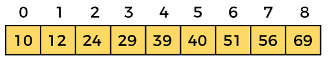
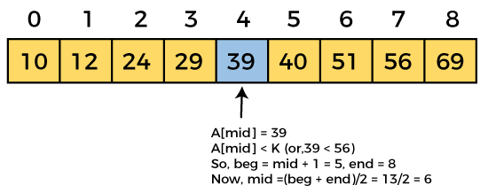

### Binary Search 

Binary search is the search technique that works efficiently on sorted lists. Hence, to search an element into some list using the binary search technique, we must ensure that the list is sorted.

Binary search follows the divide and conquer approach in which the list is divided into two halves, and the item is compared with the middle element of the list. If the match is found then, the location of the middle element is returned. Otherwise, we search into either of the halves depending upon the result produced through the match.

### Algorithm 

Binary Search Algorithm: The basic steps to perform Binary Search are:
- Begin with the mid element of the whole array as search key.
- If the value of the search key is equal to the item then return index of the search key.
- Or if the value of the search key is less than the item in the middle of the interval, narrow the interval to the lower half.
- Otherwise, narrow it to the upper half.
- Repeatedly check from the second point until the value is found or the interval is empty.

Step-by-step Binary Search Algorithm: We basically ignore half of the elements just after one comparison.
- Compare x with the middle element.
- If x matches with the middle element, we return the mid index.
- Else If x is greater than the mid element, then x can only lie in the right half subarray after the mid element. So we recur for the right half.
- Else (x is smaller) recur for the left half.

### Working with binary search

To understand the working of the binary search algorithm, let's take a sorted array. It will be easy to understand the working of Binary search with an example.

There are two method to implement the binary search algorithm:
- Iterative method
- Recursive method

Let the elements of array be:

Let the element to search is K = 56.

We have to use the formula to calculate the mid of the array: mid = (begin + end) / 2

So, in the given array, we have begin = 0, end = 8, mid = (0 + 8)/2 = 4. So 4 is the mid to the array.

Now the element to search is found. So algorithm will return the index of the element matched.

### Binary Search Complexity

| Case | Time Complexity | Space Complexity |
| Best | O(1)            | O(1) |
| Average | O(logn)      | O(1) |
| Worst   | O(logn)      | O(1) |