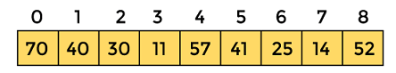
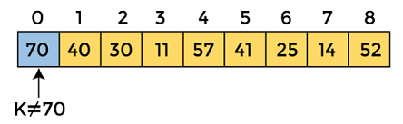
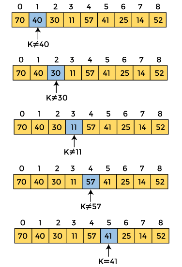

### Linear Search

Linear search is also called as sequential search algorithm. It is the simplest searching algorithm. In Linear search, we simply traverse the list completely and match each element of the list with the item whose location is to be found. If the match is found, then the location of the item is returned; otherwise, the algorithm returns NULL.

It is widely used to search an element from the unordered list, i.e., the list in which items are not sorted. The worst-case time complexity of linear search is O(n).

The steps used in the implementation of Linear Search are listed as follows:

```
First, we have to traverse the array elements using a for loop.
In each iteration of for loop, compare the search element with the current array element, and -
If the element matches, then return the index of the corresponding array element.
If the element does not match, then move to the next element.
If there is no match or the search element is not present in the given array, return -1.
```

### Working with linear search

To understand the working of linear search algorithm, let's take an unsorted array. It will be easy to understand the working of linear search with an example.

Let the element of array are:



Let the element to be searched is K = 41

Now, start from the first element and compare K with each element of the array.



The value of K, i.e., is not matched with the first element of the array. So move to the next element. And follow the same process until the respective element is found.



Now, the element to be searched is found. So algorithm will return the index of the element matched.

### Linear Search Complexity

| Case | Time Complexity | Space Complexity |
| ---- | ----- | ---- |
| Best | O(1) | O(1) |
| Average | O(n) | O(1) |
| Worst | O(n) | | O(1) |

- Best case copmlexity in linear search, best case occurs when the element we are finding is at the first position of the array. The best-case time complexity of linear search is O(1).
- Average case complexity in linear search is O(n).
- Worst case complexity in linear search has the worst case when the element we are looking is present at the end of the array. The worst-case in linear search could be when the target element is not present in the given array, and we have to traverse the entire array. The worst-case time complexity of linear search is O(n).

- The space complexity of linear search is O(1) since we only store current compared data.