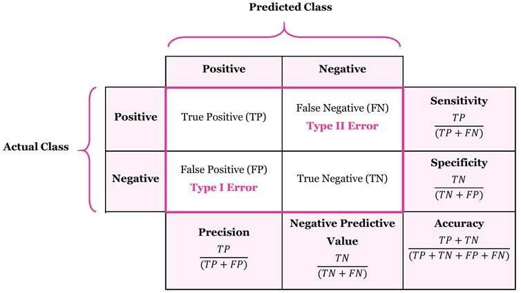
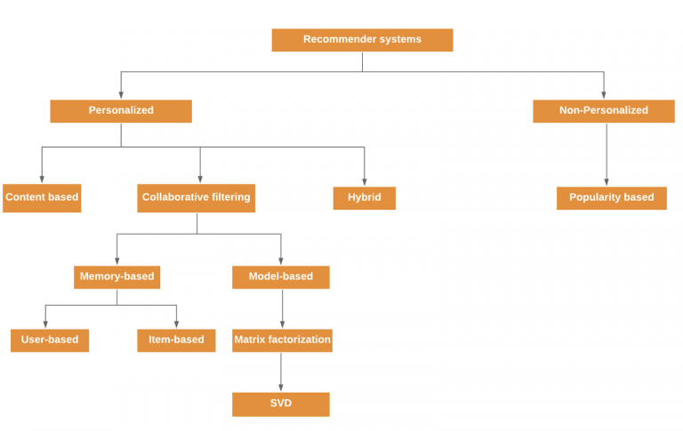

<h3>Machine Learning</h3>

[[Wikipedia](https://en.wikipedia.org/wiki/Machine_learning)] Machine learning (ML) is a field of inquiry devoted to understanding and building methods that 'learn', that is, methods that leverage data to improve performance on some set of tasks.[1] It is seen as a part of artificial intelligence. Machine learning algorithms build a model based on sample data, known as training data, in order to make predictions or decisions without being explicitly programmed to do so.[2] Machine learning algorithms are used in a wide variety of applications, such as in medicine, email filtering, speech recognition, and computer vision, where it is difficult or unfeasible to develop conventional algorithms to perform the needed tasks.

**Key points show the importance of Machine Learning**
- Rapid increment in the production of data
- Solving complex problems, which are difficult for human
- Decision making in various sector including finance
- Finding hidden patterns and extracting useful information from data

##### Classification of Machine Learning
At a broad level, machine learning can be classified into tree types:
- Supervised machine learning
- Unsupervised machine learning
- Reinforcement learning

#### Machine Learning Life Cycle

Machine learning has given the computer systems the abilities to automatically learn without being explicitly programmed. But how does a machine learning system work? So, it can be described using the life cycle of machine learning. Machine learning life cycle is a cyclic process to build an efficient machine learning project. The main purpose of the life cycle is to find a solution to the problem or project.

Machine learning life cycle involves seven major steps, which are given below:

Gathering Data -> Data Preparation -> Data Wrangling -> Analyse Data -> Train the model -> Test the model -> Deployment

The most important thing in the complete process is to understand the problem and to know the purpose of the problem. Therefore, before starting the life cycle, we need to understand the problem because the good result depends on the better understanding of the problem.

In the complete life cycle process, to solve a problem, we can create a machine learning system called "model", and this model is created by providing "training". But to train a model, we need data, hence cycle starts by collecting data.

- Gathering Data

    Data gathering is the first step of the machine learning life cycle. The goal of this step is to identify and obtain all data-related problems.
    
    In this step, we need to identify the different data sources, as data can be collected from various sources such as files, databse, internet, or mobile devices. It is one of the most important steps of the life cycle. The quantity and quality of the collected data will determien the efficiency of the output. The more will be the data, the more accurate will be prediction.
    
    This step includes the below task:
    - Identify variuos data sources
    - Collect data
    - Intergrate the data obtained from different sources
    
    By performing the above task, we get coherent set of data, also called as a dataset. It will be used in futher steps.

- Data Preparation

    After collecting the data, we need to prepare it for futher steps. Data preparation is a step where we put our data into a suitable place and preapre it to use in our machine learning training. In this steps, first we put all data together, and then randomize the ordering of data.

    This steps can be further divided into two processes:
    - Data exploration
    
        It is used to understand the nature of data that we have to work with. We need to understand the characteristics, format, and quality of data. A better understanding of data leads to an effective outcome. In this, we find Correlations, general trends, and outliers.
        
    - Data pre-processing
    
        Now the next step is preprocessing of data for its analysis.
    
- Data Wrangling

    Data wrangling is the process of cleaning and converting raw data into a useable format. It is the process of cleaning the data, selecting the variable to use, and transforming the data in a proper format to make it more suitable for analysis in the next step. It is one of the most important steps of the complete process. Cleaning of data is required to address the quality issues.

    It is not necessary that data we have collected is always of our use as some of the data may not be useful. In real-world applications, collected data may have various issues, including:
    - Missing values
    - Duplicate data
    - Invalid data
    - Noise

    So, we use various filtering techniques to clean the data. It is mandatory to detect and remove the above issue because it can negatively affect the quality of the outcome.

- Data Analysis

    Now the cleaned and prepared data is passed on to the analysis step. This step involves:
    - Selection of analytical techniques
    - Building models
    - Review the result
    
    The aim of this step is to build a machine learning model to analyze the data using various analytical techniques and review the outcome. It starts with the determination of the type of the problems, where we select the machine learning techniques such as Classification, Regression, Cluster analysis, Association, etc. then build the model using prepared data, and evaluate the model.
    
    Hence, in this step, we take the data and use machine learning algorithms to build the model.

- Train the model
    
    Now the next step is to train the model, in this step we train our model to improve its performance for better outcome of the problem.

    We use datasets to train the model using various machine learning algorithms. Training a model is required so that it can understand the various patterns, rules, and, features.
    
- Test the model

    Once our machine learning model has been trained on a given dataset, then we test the model. In this step, we check for the accuracy of our model by providing a test dataset to it.

    Testing the model determines the percentage accuracy of the model as per the requirement of project or problem.

- Deployment

    The last step of machine learning life cycle is deployment, where we deploy the model in the real-world system.

    If the above-prepared model is producing an accurate result as per our requirement with acceptable speed, then we deploy the model in the real system. But before deploying the project, we will check whether it is improving its performance using available data or not. The deployment phase is similar to making the final report for a project.

[**Difference between Aritifical Intelligence (AI) and Machine Learning**](./doc/diff-AI-ML.md)

---

<h4>Dimensionality Reduction Methods</h4>

[[Wikipedia](https://en.wikipedia.org/wiki/Dimensionality_reduction)] Dimensionality reduction, or dimension reduction, is the transformation of data from a high-dimensional space into a low-dimensional space so that the low-dimensional representation retains some meaningful properties of the original data, ideally close to its intrinsic dimension. Working in high-dimensional spaces can be undesirable for many reasons; raw data are often sparse as a consequence of the curse of dimensionality, and analyzing the data is usually computationally intractable (hard to control or deal with). Dimensionality reduction is common in fields that deal with large numbers of observations and/or large numbers of variables, such as signal processing, speech recognition, neuroinformatics, and bioinformatics.

---

<h5>Feature selection</h5>

[[Wikipedia](https://en.wikipedia.org/wiki/Dimensionality_reduction)] Feature selection approaches try to find a subset of the input variables (also called features or attributes). The three strategies are: the filter strategy (e.g. information gain), the wrapper strategy (e.g. search guided by accuracy), and the embedded strategy (selected features are added or removed while building the model based on prediction errors).

Data analysis such as regression or classification can be done in the reduced space more accurately than in the original space.

---

<h5>Feature projection</h5>

[[Wikipedia](https://en.wikipedia.org/wiki/Dimensionality_reduction)] Feature projection (also called feature extraction) transforms the data from the high-dimensional space to a space of fewer dimensions. The data transformation may be linear, as in principal component analysis (PCA), but many nonlinear dimensionality reduction techniques also exist.[4][5] For multidimensional data, tensor representation can be used in dimensionality reduction through multilinear subspace learning.

- [x] [Principal Component Analysis (PCA)](./notebooks/PCA.ipynb)
- [ ] [t-distributed stochastic neighbor embedding (t-SNE)]()
- [ ] [Kernel PCA]()
- [ ] [Graph-based kernel PCA]()
- [ ] [Linear Discriminant Analysis (LDA)]()
- [ ] [Generalized Discriminant Analysis (GDA)]()
- [ ] [Autoencoder]()
- [ ] [Missing Values Ratio]()
- [ ] [Low Variance Filter]()
- [ ] [High Correlation Filter]()
- [ ] [Non-negative matrix factorization (NMF)]()
- [ ] [Uniform Manifold Approximation and Projection (UMAP)]()

---

<h5>Dimension reduction</h5>

[[Wikipedia](https://en.wikipedia.org/wiki/Dimensionality_reduction)] For high-dimensional datasets (i.e. with number of dimensions more than 10), dimension reduction is usually performed prior to applying a K-nearest neighbors algorithm (k-NN) in order to avoid the effects of the curse of dimensionality.[20]

Feature extraction and dimension reduction can be combined in one step using principal component analysis (PCA), linear discriminant analysis (LDA), canonical correlation analysis (CCA), or non-negative matrix factorization (NMF) techniques as a pre-processing step followed by clustering by K-NN on feature vectors in reduced-dimension space. In machine learning this process is also called low-dimensional embedding.[21]

For very-high-dimensional datasets (e.g. when performing similarity search on live video streams, DNA data or high-dimensional time series) running a fast approximate K-NN search using locality-sensitive hashing, random projection, "sketches", or other high-dimensional similarity search techniques from the VLDB conference toolbox might be the only feasible option.

---

<h4>Evaluation Metrics</h4>

- [x] TP, FP, TN, FN

    Performance measurement TP, TN, FP, FN are the parameters used in the evaluation of specificity, sensitivity and accuracy.
    - True Positive or TP is the number of perfectly identified DR pictures. 
    - True Negatives or TN is the number of perfectly detected non DR picures. 
    - False Positive or FP is the number of wrongly detected DR images as positive which is actually non DR. 
    - False Negative or FN is the number of wrongly detected non DR which is actually DR. 
    
    The figure below shows the measurements using these parameters. 
    - Sensitivity is the percentage of positive cases and specificity is the percentage of negative cases. 
    - Accuracy is the percentage of correctly identified cases.

    
    
    By using TP, FP, TN, FN, we can calculate the sensitivity, specificity, accuracy, precision, negative predictive value to evaluate our machine learning model performance.
    - Sensitivity = TP / (TP + FN)
    - Specificity = TN / (FP + TN)
    - Accuracy = (TP + TN) / (TP + FN + FP + TN)
    - Precision = TP / (TP + FP)
    - Negative Predictive Value: TN / (TN + FN)
    
- [x] Confusion Matrix
    
    Confusion matrix can be usd in error analysis which answer the question: why a given model has misclassified an instance in the way it has. Use Confusion matrix, we could:
    - Identifying different "classes" or error that the system makes (predicted vs. actual labels).
    - Hypothesising as to what has caused the different errors, and testing those hypotheses against the actual data.
    - Quantifying whether (for different classes) it is a question of data quantity/sparsity, or something more fundamental than that.
    - Feeding those hypotheses back into feature/model engineering to see if the model can be improved.

> **Error Analysis**: Why a given model has misclassified an instance in the way it has.

> **Model Interpretability**: Why a given model has classified an instance in the way it has.

- [ ] [Precision, Recall, F1-score]()
- [ ] [Area Under the Curve - Receiver Operating Characteristics (AUC-ROC)]()
- [ ] [Log loss]()
- [ ] [Entropy]()
- [ ] [Mutual Information]()
- [ ] [Information Gain]()
- [ ] [Joint Mutual Information]()
- [ ] [Bootstrap Evaluation]()

---

<h4>Wrapper Methods</h4>

- [ ] [Step-wise Forward Feature Selection]()
- [ ] [Backward Feature Elimination]()
- [ ] [Exhaustive Feature Selection]()
- [ ] [Recursive Feature Elimination]()
- [ ] [Boruta]()

---

<h4>Embeded Methods</h4>

- [ ] [Lasso Regularization (L1)]()
- [ ] [Ridge Regularization (L2)]()
- [ ] [Random Forest Importance]()

---

<h4>Ensemble Learning</h4>

- [ ] [Bagging (Bootstrap Aggregating)]()
- [ ] [Boosting]()

---

<h4>Data Processing Concepts</h4>

- [ ] [One Hot Encoding]()
- [ ] [Dummy Encoding]()
- [ ] [Normalisation]()
- [ ] [Standardisation]()
- [ ] [Discretisation]()

---

<h4>Supervised Learning Methods</h4>

 
Supervised learning is a type of machine learning method in which we provide sample labeled data to the machine system in order to train it,and on that basis, it predicts the output.

The system creates a model using labeled data to understnad the datasets and learn about each data, once the training and processing are done then we test the model by providing a sample data to check whether it is predicting the exact output or not.

To goal of supervised machine learning is to map input data with the output data. The supervised learning is based on supervision, and it is the same as when a student learns things in the supervision of the teacher. The example of supervised learning is spam filtering.

Supervised learning can be grouped further in two categories of algorithms:
- Classification
- Regression
 
- [ ] [K Nearest Neighbors](./notebooks/SL/KNN.ipynb)
- [ ] [Regression](./notebooks/SL/Regression.ipynb)
    - [ ] [Linear Regression](./notebooks/SL/LinearRegression.ipynb)
    - [ ] [Simple Linear Regression]()
    - [ ] [Multiple Linear Regression]()  
    - [ ] [Logistic Regression](./notebooks/SL/LogisticRegression.ipynb)
    - [ ] [Backward Elimination]()
    - [ ] [Polynomial Regression]()
- [ ] [Perceptron](./notebooks/SL/Perceptron.ipynb)
- [ ] [Navie Bayes](./notebooks/SL/NaiveBayes.ipynb)
- [ ] [Support Vector Machine (SVM)](./notebooks/SL/SVM.ipynb)
- [ ] [Decision Tree]()
- [ ] [Random Forest]()
- [ ] [AdaBoost]()
- [ ] [XGBoost]()
- [ ] [Light GBM]()
- [ ] [Recommender System](https://thingsolver.com/introduction-to-recommender-systems/)
    
    
    
---

<h4>Unsupervised Learning Methods</h4>

Unsupervised learning is a learning method in which a machien learns without any supervision. The trianing is provided to the machine with the set of data that has not been labeled, classified, or categorized, and the algorithm needs to act on that data without any supervision. The goal of unsupervised learning is to restructure the input data into new features or a group of objects with similar patterns.

In unsupervised learning, we don't have a predetermined result. The machien tires to find useful insights from the huge amount of data. It can be further classified into two categories:
- Clustering
- Association

- [ ] [k-means clustering (KMean)](./notebooks/KMean.ipynb)
- [ ] [Hierarchical Clustering]()
    - [ ] Sinlge Linkage
    - [ ] Complete Linkage
    - [ ] Average Linkage
    - [ ] Centroid Linakge
- [ ] [Anomaly detection]()
- [ ] [VAT: Visual Assessment of (Cluster) Tendency]()
- [ ] [Indenpendent Component Analysis (IDA)]()
- [ ] [Apriori algorithm]()
- [ ] [Singular value decomposition]()
- [ ] [DBSCAN]()
- [ ] [Mean Shift]()
- [ ] [OPTICS]()
- [ ] [Spectral Clustering]()
- [ ] [Mixture of Gaussians]()
- [ ] [BIRCH]()
- [ ] [Agglomerative Clustering]()

- [ ] Supervised learning vs. Unsupervised learning
    
    |            | Supervised Learning              | Unsupervised Learning    |
    | ---------- | -------------------------------- | ------------------------ |
    | Discrete   | Classification Categorization | Clustering               |
    | Continuous | Regression                       | Dimensionality Reduction |
---

<h3>Neural Network</h3>

- [ ] [Neuron]()
- [ ] [Layers]()
- [ ] [Epoch]()
- [ ] [Neural Network]()
- [ ] [Convolutional Neural Network]()
- [ ] [Genetic Algorithm]()

---

<h4>Activation Functions</h4>

- [ ] [Linear Activation]()
- [ ] [Heaviside Activation]()
- [ ] [Logistic Activation]()
- [ ] [Sigmoid]()
- [ ] [Rectified Linear Unit (ReLU)]()
- [ ] [tanh]()
- [ ] [Softmax]()
- [ ] [Auto Encoder]()
- [ ] [Genetric Algorithm]()
- [ ] [Ensembler]()
