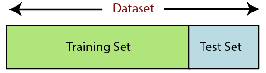

<h3>Machine Learning</h3>

[[Wikipedia](https://en.wikipedia.org/wiki/Machine_learning)] Machine learning (ML) is a field of inquiry devoted to understanding and building methods that 'learn', that is, methods that leverage data to improve performance on some set of tasks.[1] It is seen as a part of artificial intelligence. Machine learning algorithms build a model based on sample data, known as training data, in order to make predictions or decisions without being explicitly programmed to do so.[2] Machine learning algorithms are used in a wide variety of applications, such as in medicine, email filtering, speech recognition, and computer vision, where it is difficult or unfeasible to develop conventional algorithms to perform the needed tasks.

**Key points show the importance of Machine Learning**
- Rapid increment in the production of data
- Solving complex problems, which are difficult for human
- Decision making in various sector including finance
- Finding hidden patterns and extracting useful information from data

##### Classification of Machine Learning
At a broad level, machine learning can be classified into tree types:
- Supervised machine learning
- Unsupervised machine learning
- Reinforcement learning

#### Machine Learning Life Cycle

Machine learning has given the computer systems the abilities to automatically learn without being explicitly programmed. But how does a machine learning system work? So, it can be described using the life cycle of machine learning. Machine learning life cycle is a cyclic process to build an efficient machine learning project. The main purpose of the life cycle is to find a solution to the problem or project.

Machine learning life cycle involves seven major steps, which are given below:

Gathering Data -> Data Preparation -> Data Wrangling -> Analyse Data -> Train the model -> Test the model -> Deployment

The most important thing in the complete process is to understand the problem and to know the purpose of the problem. Therefore, before starting the life cycle, we need to understand the problem because the good result depends on the better understanding of the problem.

In the complete life cycle process, to solve a problem, we can create a machine learning system called "model", and this model is created by providing "training". But to train a model, we need data, hence cycle starts by collecting data.

- Gathering Data

    Data gathering is the first step of the machine learning life cycle. The goal of this step is to identify and obtain all data-related problems.
    
    In this step, we need to identify the different data sources, as data can be collected from various sources such as files, databse, internet, or mobile devices. It is one of the most important steps of the life cycle. The quantity and quality of the collected data will determien the efficiency of the output. The more will be the data, the more accurate will be prediction.
    
    This step includes the below task:
    - Identify variuos data sources
    - Collect data
    - Intergrate the data obtained from different sources
    
    By performing the above task, we get coherent set of data, also called as a dataset. It will be used in futher steps.

- Data Preparation

    After collecting the data, we need to prepare it for futher steps. Data preparation is a step where we put our data into a suitable place and preapre it to use in our machine learning training. In this steps, first we put all data together, and then randomize the ordering of data.

    This steps can be further divided into two processes:
    - Data exploration
    
        It is used to understand the nature of data that we have to work with. We need to understand the characteristics, format, and quality of data. A better understanding of data leads to an effective outcome. In this, we find Correlations, general trends, and outliers.
        
    - Data pre-processing
    
        Now the next step is preprocessing of data for its analysis.
    
- Data Wrangling

    Data wrangling is the process of cleaning and converting raw data into a useable format. It is the process of cleaning the data, selecting the variable to use, and transforming the data in a proper format to make it more suitable for analysis in the next step. It is one of the most important steps of the complete process. Cleaning of data is required to address the quality issues.

    It is not necessary that data we have collected is always of our use as some of the data may not be useful. In real-world applications, collected data may have various issues, including:
    - Missing values
    - Duplicate data
    - Invalid data
    - Noise

    So, we use various filtering techniques to clean the data. It is mandatory to detect and remove the above issue because it can negatively affect the quality of the outcome.

- Data Analysis

    Now the cleaned and prepared data is passed on to the analysis step. This step involves:
    - Selection of analytical techniques
    - Building models
    - Review the result
    
    The aim of this step is to build a machine learning model to analyze the data using various analytical techniques and review the outcome. It starts with the determination of the type of the problems, where we select the machine learning techniques such as Classification, Regression, Cluster analysis, Association, etc. then build the model using prepared data, and evaluate the model.
    
    Hence, in this step, we take the data and use machine learning algorithms to build the model.

- Train the model
    
    Now the next step is to train the model, in this step we train our model to improve its performance for better outcome of the problem.

    We use datasets to train the model using various machine learning algorithms. Training a model is required so that it can understand the various patterns, rules, and, features.
    
- Test the model

    Once our machine learning model has been trained on a given dataset, then we test the model. In this step, we check for the accuracy of our model by providing a test dataset to it.

    Testing the model determines the percentage accuracy of the model as per the requirement of project or problem.

- Deployment

    The last step of machine learning life cycle is deployment, where we deploy the model in the real-world system.

    If the above-prepared model is producing an accurate result as per our requirement with acceptable speed, then we deploy the model in the real system. But before deploying the project, we will check whether it is improving its performance using available data or not. The deployment phase is similar to making the final report for a project.
    
---

[**Difference between Aritifical Intelligence (AI) and Machine Learning**](./doc/diff-AI-ML.md)

---

#### Data Preprocessing in Machine Learning

Data preprocessing is a process of preparing the raw data and making it suitable for a machine learning model. It is the first and crucial step while creating a machine learning model.

When creating a machine learning project, it is not always a case that we come across the clean and formatted data. And while doing any operation with data, it is mandatory to clean it and put it a formatted way. So for this, we use data preprocessing task.

#### Why do we need Data Preprocessing

A real-world data generally contains noises, missing values, and maybe in an unusable format which cannot be directly used for machine learning models. Data preprocessing is required tasks for cleaning the data and making it suitable for a machine learning model which also increases the accuracy and efficiency of a machine learning model. It involves below steps:
- Getting the dataset

    To create a machine learning model, the first thing we required is a dataset as a machine learning model completely works on data. The collected data for a particular problem in a proper format is known as the dataset.
    
    Dataset may be of different formats for different purposes, such as, if we want to create a machine learning model for business purpose, then dataset will be different with the dataset required for a liver patient. So each dataset is different from another dataset. To use the dataset in our code, we usually put it into a CSV file. However, sometimes, we may also need to use an HTML or xlsx. file.
    
- Importing libraries

    In order to perform data preprocessing using Python, we need to import some predefined Python libraries. Most common libraries are: numpy, pandas and matplotlib.
    
- Importing datasets

    We need to import the datasets which we have collected for our machine learning project. But before importing a dataset, we need to set the current directory as a working directory. To set a working directory in Spyder IDE, we need to follow the below steps:
    - Save your Python file in the directory which contains dataset
    - Go to File explorer option in IDE (jupyter/Spyder) and select the required directory.

- Finding missing data

    The next step of data preprocessing is to handle missing data in the datasets. If our dataset contains some missing data, then it may create a huge problem for our machine learning model. Hence it is necessary to handle missing values present in the dataset.

    Ways to handle missing data: There are mainly two ways to handle missing data, which are:
    - By deleting the particular row: The first way is used to commonly deal with null values. In this way, we just delete the specific row or column which consists of null values. But this way is not so efficient and removing data may lead to loss of information which will not give the accurate output.
    - By calculating the mean: In this way, we will calculate the mean of that column or row which contains any missing value and will put it on the place of missing value. This strategy is useful for the features which have numeric data such as age, salary, year, etc. Here, we will use this approach.
    - To handle missing values, we will use Scikit-learn library in our code, which contains various libraries for building machine learning models.

- Encoding categorical data

    Categorical data is data which has some categories such as, in our dataset; there are two categorical variable, Country, and Purchased.

    Since machine learning model completely works on mathematics and numbers, but if our dataset would have a categorical variable, then it may create trouble while building the model. So it is necessary to encode these categorical variables into numbers.

- Splitting dataset into training and test set

    In machine learning data preprocessing, we divide our dataset into a training set and test set. This is one of the crucial steps of data preprocessing as by doing this, we can enhance the performance of our machine learning model.

    Suppose, if we have given training to our machine learning model by a dataset and we test it by a completely different dataset. Then, it will create difficulties for our model to understand the correlations between the models.

    If we train our model very well and its training accuracy is also very high, but we provide a new dataset to it, then it will decrease the performance. So we always try to make a machine learning model which performs well with the training set and also with the test dataset. Here, we can define these datasets as:

    
    
    Training Set: A subset of dataset to train the machine learning model, and we already know the output.

    Test set: A subset of dataset to test the machine learning model, and by using the test set, model predicts the output.
    
- Feature scaling

    Feature scaling is the final step of data preprocessing in machine learning. It is a technique to standardize the independent variables of the dataset in a specific range. In feature scaling, we put our variables in the same range and in the same scale so that no any variable dominate the other variable.

---

<h4>Dimensionality Reduction Methods</h4>

[[Wikipedia](https://en.wikipedia.org/wiki/Dimensionality_reduction)] Dimensionality reduction, or dimension reduction, is the transformation of data from a high-dimensional space into a low-dimensional space so that the low-dimensional representation retains some meaningful properties of the original data, ideally close to its intrinsic dimension. Working in high-dimensional spaces can be undesirable for many reasons; raw data are often sparse as a consequence of the curse of dimensionality, and analyzing the data is usually computationally intractable (hard to control or deal with). Dimensionality reduction is common in fields that deal with large numbers of observations and/or large numbers of variables, such as signal processing, speech recognition, neuroinformatics, and bioinformatics.

---

<h5>Feature selection</h5>

[[Wikipedia](https://en.wikipedia.org/wiki/Dimensionality_reduction)] Feature selection approaches try to find a subset of the input variables (also called features or attributes). The three strategies are: the filter strategy (e.g. information gain), the wrapper strategy (e.g. search guided by accuracy), and the embedded strategy (selected features are added or removed while building the model based on prediction errors).

Data analysis such as regression or classification can be done in the reduced space more accurately than in the original space.

---

<h5>Feature projection</h5>

[[Wikipedia](https://en.wikipedia.org/wiki/Dimensionality_reduction)] Feature projection (also called feature extraction) transforms the data from the high-dimensional space to a space of fewer dimensions. The data transformation may be linear, as in principal component analysis (PCA), but many nonlinear dimensionality reduction techniques also exist.[4][5] For multidimensional data, tensor representation can be used in dimensionality reduction through multilinear subspace learning.

- [x] [Principal Component Analysis (PCA)](./notebooks/PCA.ipynb)
- [ ] [t-distributed stochastic neighbor embedding (t-SNE)]()
- [ ] [Kernel PCA]()
- [ ] [Graph-based kernel PCA]()
- [ ] [Linear Discriminant Analysis (LDA)]()
- [ ] [Generalized Discriminant Analysis (GDA)]()
- [ ] [Autoencoder]()
- [ ] [Missing Values Ratio]()
- [ ] [Low Variance Filter]()
- [ ] [High Correlation Filter]()
- [ ] [Non-negative matrix factorization (NMF)]()
- [ ] [Uniform Manifold Approximation and Projection (UMAP)]()

---

<h5>Dimension reduction</h5>

[[Wikipedia](https://en.wikipedia.org/wiki/Dimensionality_reduction)] For high-dimensional datasets (i.e. with number of dimensions more than 10), dimension reduction is usually performed prior to applying a K-nearest neighbors algorithm (k-NN) in order to avoid the effects of the curse of dimensionality.[20]

Feature extraction and dimension reduction can be combined in one step using principal component analysis (PCA), linear discriminant analysis (LDA), canonical correlation analysis (CCA), or non-negative matrix factorization (NMF) techniques as a pre-processing step followed by clustering by K-NN on feature vectors in reduced-dimension space. In machine learning this process is also called low-dimensional embedding.[21]

For very-high-dimensional datasets (e.g. when performing similarity search on live video streams, DNA data or high-dimensional time series) running a fast approximate K-NN search using locality-sensitive hashing, random projection, "sketches", or other high-dimensional similarity search techniques from the VLDB conference toolbox might be the only feasible option.

---

<h4>Evaluation Metrics</h4>

- [x] TP, FP, TN, FN

    Performance measurement TP, TN, FP, FN are the parameters used in the evaluation of specificity, sensitivity and accuracy.
    - True Positive or TP is the number of perfectly identified DR pictures. 
    - True Negatives or TN is the number of perfectly detected non DR picures. 
    - False Positive or FP is the number of wrongly detected DR images as positive which is actually non DR. 
    - False Negative or FN is the number of wrongly detected non DR which is actually DR. 
    
    The figure below shows the measurements using these parameters. 
    - Sensitivity is the percentage of positive cases and specificity is the percentage of negative cases. 
    - Accuracy is the percentage of correctly identified cases.

    
    
    By using TP, FP, TN, FN, we can calculate the sensitivity, specificity, accuracy, precision, negative predictive value to evaluate our machine learning model performance.
    - Sensitivity = TP / (TP + FN)
    - Specificity = TN / (FP + TN)
    - Accuracy = (TP + TN) / (TP + FN + FP + TN)
    - Precision = TP / (TP + FP)
    - Negative Predictive Value: TN / (TN + FN)
    
- [x] Confusion Matrix
    
    Confusion matrix can be usd in error analysis which answer the question: why a given model has misclassified an instance in the way it has. Use Confusion matrix, we could:
    - Identifying different "classes" or error that the system makes (predicted vs. actual labels).
    - Hypothesising as to what has caused the different errors, and testing those hypotheses against the actual data.
    - Quantifying whether (for different classes) it is a question of data quantity/sparsity, or something more fundamental than that.
    - Feeding those hypotheses back into feature/model engineering to see if the model can be improved.

> **Error Analysis**: Why a given model has misclassified an instance in the way it has.

> **Model Interpretability**: Why a given model has classified an instance in the way it has.

- [ ] [Precision, Recall, F1-score]()
- [ ] [Area Under the Curve - Receiver Operating Characteristics (AUC-ROC)]()
- [ ] [Log loss]()
- [ ] [Entropy]()
- [ ] [Mutual Information]()
- [ ] [Information Gain]()
- [ ] [Joint Mutual Information]()
- [ ] [Bootstrap Evaluation]()

---

<h4>Wrapper Methods</h4>

- [ ] [Step-wise Forward Feature Selection]()
- [ ] [Backward Feature Elimination]()
- [ ] [Exhaustive Feature Selection]()
- [ ] [Recursive Feature Elimination]()
- [ ] [Boruta]()

---

<h4>Embeded Methods</h4>

- [ ] [Lasso Regularization (L1)]()
- [ ] [Ridge Regularization (L2)]()
- [ ] [Random Forest Importance]()

---

<h4>Ensemble Learning</h4>

- [ ] [Bagging (Bootstrap Aggregating)]()
- [ ] [Boosting]()

---

<h4>Data Processing Concepts</h4>

- [ ] [One Hot Encoding]()
- [ ] [Dummy Encoding]()
- [ ] [Normalisation]()
- [ ] [Standardisation]()
- [ ] [Discretisation]()

---

<h4>Supervised Learning Methods</h4>

 
Supervised learning is a type of machine learning method in which we provide sample labeled data to the machine system in order to train it,and on that basis, it predicts the output.

The system creates a model using labeled data to understnad the datasets and learn about each data, once the training and processing are done then we test the model by providing a sample data to check whether it is predicting the exact output or not.

> Goal: Learn mappting from attributes to concepts: concept = f(attributes)

To goal of supervised machine learning is to map input data with the output data. The supervised learning is based on supervision, and it is the same as when a student learns things in the supervision of the teacher. The example of supervised learning is spam filtering.

Supervised learning can be grouped further in two categories of algorithms:

- Classification
    - [ ] [Decision Tree](./notebooks/supervised/classification/)
    - [ ] [Random Forest](./notebooks/supervised/classification/)
    - [ ] [Logistic Regression](./notebooks/supervised/classification/)
    - [ ] [K Nearest Neighbors](./notebooks/supervised/classification/KNN.ipynb)
    - [ ] [Perceptron](./notebooks/supervised/classification/Perceptron.ipynb)
    - [ ] [Navie Bayes](./notebooks/supervised/classification/NaiveBayes.ipynb)
    - [ ] [Support Vector Machine (SVM)](./notebooks/supervised/classification/SVM.ipynb)
    - [ ] [AdaBoost](./notebooks/supervised/classification/)
    - [ ] [XGBoost](./notebooks/supervised/classification/)
    - [ ] [Light GBM](./notebooks/supervised/classification/)
    - [ ] [Recommender System](https://thingsolver.com/introduction-to-recommender-systems/)
    
        

- Regression

    Regression algorithms are used if there is a relationship between the input variable and the output variable. It is used for the prediction of continous variables, such as Weather forecasting, Market Treds, etc. Below are some popular Regression algorithms which come under supervised learning.
    
    - [x] [Regression Analysis](./doc/regression.md)
    - [ ] [Linear Regression](./notebooks/supervised/regression/LinearRegression.ipynb)
    
        - Linear regression is a statistical regression method which is used for predictive analysis.
        - It is one of the very simple and easy algorithm which works on regression and shows the relationship between the continuous variables.
        - It is used for solving the regression problem in machine learning.
        - Linear regression shows the linear relationship between the independent variable (X-axis) and the dependent variable (Y-axis), hence called linear regression.
        - If there is only one input variable (x), then such linear regression is called simple linear regression. And if there is more than one input variable, then such linear regression is called multiple linear regression.
        - The relationship between variables in the linear regression model can be explained via mathematical equation Y = aX + b.
    
    - [ ] [Simple Linear Regression](./notebooks/supervised/regression/)
    - [ ] [Multiple Linear Regression](./notebooks/supervised/regression/)  
    - [ ] [Logistic Regression](./notebooks/supervised/regression/LogisticRegression.ipynb)
    - [ ] [Backward Elimination](./notebooks/supervised/regression/)
    - [ ] [Polynomial Regression](./notebooks/supervised/regression/)
    - [ ] [Bayesian Linear Regression](./notebooks/supervised/regression/)
    - [ ] [Support Vector Regression](./notebooks/supervised/regression/)
    - [ ] [Decision Tree Regression](./notebooks/supervised/regression/)
    - [ ] [Random Forest Regression](./notebooks/supervised/regression/)
    - [ ] [Ridge Regression](./notebooks/supervised/regression/)
    - [ ] [Lasso Regression](./notebooks/supervised/regression/)

| Advantages of Supervised Learning | Disadvantages of Supervised Learning |
| ---- | ---- |
| With the help of supervised learning, the model can predict the output on the basis of prior experiences | Supservised learning models are not suitable for handling the complex tasks |
| In supervised learning, we can have an exact idea about the classes of objects | Supervised learning cannot predict the correct output if the test data is different from the training dataset |
| Supervised learning model helps us to solve various real-world problems such as fraud detection, spam filtering | Training requireds lots of computation times |
| | In supervised learning, we need enough knowledge about the classes of object |

---

<h4>Unsupervised Learning Methods</h4>

Unsupervised learning is a learning method in which a machien learns without any supervision. The trianing is provided to the machine with the set of data that has not been labeled, classified, or categorized, and the algorithm needs to act on that data without any supervision. The goal of unsupervised learning is to restructure the input data into new features or a group of objects with similar patterns. For example:
- Unsupervised learning is helpful to finding useful insights from data
- Unsupervised learning is much similar as a human learns to think by their own experiences, which makes it clser to the real AI
- Unsupervised learning works on unlabeled and uncategorized data which make unsupervised learning more important
- In real-world, we do not always have input data with the corresponding output so to solve such cases, we need unsupervised learning 

> Goal: learn mapping from attributes to concepts: concept = f(attributes)

In unsupervised learning, we don't have a predetermined result. The machien tires to find useful insights from the huge amount of data. It can be further classified into two categories:
- Clustering
- Association
    - Detect useful patterns, associations, correlations or casual relations between attributes or between attirbutes and concept.
    - A good pattern is a combination of attribute values where the presence of certain values strongly predicts the presence of other values.
    - Any kind of structure is considered interesting and there may be no "right" answer.
    - Evaluation can be difficult, potentially many possible association rules in one dataset.

- [ ] [k-means clustering (KMean)](./notebooks/unsupervised/clustering/KMean.ipynb)
- [ ] [Hierarchical Clustering](./notebooks/unsupervised/clustering/)
    - [ ] Sinlge Linkage
    - [ ] Complete Linkage
    - [ ] Average Linkage
    - [ ] Centroid Linakge
- [ ] [Anomaly detection]()
- [ ] [VAT: Visual Assessment of (Cluster) Tendency](./notebooks/unsupervised/clustering/)
- [ ] [Indenpendent Component Analysis (IDA)]()
- [ ] [Apriori algorithm]()
- [ ] [Singular value decomposition]()
- [ ] [DBSCAN](./notebooks/unsupervised/clustering/)
- [ ] [Mean Shift]()
- [ ] [OPTICS]()
- [ ] [Spectral Clustering]()
- [ ] [Mixture of Gaussians]()
- [ ] [BIRCH]()
- [ ] [Agglomerative Clustering]()
- [ ] [Neural Networks]()
- [ ] [Apriori Algorithm]()
- [ ] [Singular value decomposition]()

| Advantages of Unsupervised Learning | Disadvantages of Unsupervised Learning |
| ----------------------------------- | -------------------------------------- |
| Unsupervised learning is used for more complex tasks as compared to supervised learning because, in unsupervised learning, we don't have labeled input data | Unsupervised learning is intrinsically more difficult than supervised learning as it does not have corresponding output |
| Unsupervised learning is preferable as it is easy to get unlabeled data in comparison to labeled data | The result of the unsupervised learning algorithm might be less accurate as input data is not labeled, and algorithms do not know the exact output in advance |

#### Supervised learning vs. Unsupervised learning
    
|            | Supervised Learning              | Unsupervised Learning    |
| ---------- | -------------------------------- | ------------------------ |
| Discrete   | Classification Categorization | Clustering               |
| Continuous | Regression                       | Dimensionality Reduction |

| Supervised learning | Unsupervised learning |
| ------------------- | --------------------- |
| Supervised learning algorithms are trained using labeled data | Unsupervised learning algorithms are trained using unlabeled data |
| Supervised learning model takes direct feedback to check if it is predicting correct output or not | Unsupervised learning model does not take any feedback |
| Supervised learning model predicts the output | Unsupervised learning model finds the hidden patterns in data |
| In supervised learning, input data is provided to the model along with the output | In unsupervised learning, only input data is provided to the model |
| The goal of supervised learning is to train the model so that it can predict the output when it is given new data | The goal of unsupervised learning is to find the hidden patterns and useful insights from the unknown dataset |
| Supervised learning needs supervision to train the model | Unsupervised learning does not need any supervision to train the model |
| Supervised learning can be categorized in Classification and Regression problems | Unsupervised Learning can be classified in Clustering and Associations problems |
| Supervised learning can be used for those cases where we know the input as well as corresponding outputs | Unsupervised learning can be used for those cases where we have only input data and no corresponding output data |
| Supervised learning model produces an accurate result | Unsupervised learning model may give less accurate result as compared to supervised learning |
| Supervised learning is not close to true Artificial intelligence as in this, we first train the model for each data, and then only it can predict the correct output | Unsupervised learning is more close to the true Artificial Intelligence as it learns similarly as a child learns daily routine things by his experiences |
| It includes various algorithms such as Linear Regression, Logistic Regression, Support Vector Machine, Multi-class Classification, Decision tree, Bayesian Logic, etc. | It includes various algorithms such as Clustering, KNN, and Apriori algorithm |

---

#### Marr's levels of Analysis
Framework for understanding information processing systems.
- Computational Level: what is the goal of this system.
    - What structure does this machine learning model expect to see in the world?
    - What rule/pattern/model/etc. explains this data?
- Algorithm Level: How do you achieve the goal, algorithms and dadta structure?
    - Given a model, what's the best fit for this data?
    - Usually involves minimizing an error or loss function.
- Implementation Level: Physical implmenetation (circuits, neurons).
    - How to find that best fit in finite time.
    - Not always possible to solve exactly.

---

> **About model assumptions**: What kinds of assumptions might a machine learning model make then tackling these problems?

Every model makes assumptions about the world and how the concepts we want to learn relate to the attributes of the data.
- *The first assumption we make is that the concept is actually related to the attributes?*

    This assumption is so obvious that we rarely discuss it – usually we only include attributes that we think are likely to predict the concept. For example, you would probably not use “patient’s favourite song” as an attribute for skin cancer detection. However, this attribute might actually be a good predictor, because your favourite song can be a good predictor of your age, and age is a risk factor for skin cancer. You could probably come up with other “weird” predictors for each of the example models.

- *Secondly, each model makes assumptions about the ways the attributes can relate to the concepts.*

    For example, does it make more sense for the models to treat all attributes as independent predictors, or would it be better to use a model that allows the predictors to interact? In most of these cases we would expect the attributes to interact in complex ways but allowing interactions could lead to an overly complex model in the cases where there are many attributes to start with (for example, in the customer purchasing model). For the problems with numeric attributes, would we generally expect linear (or monotonic, e.g., strictly increasing or decreasing) relationships between the attributes and concepts. This is often a good simplifying assumption for machine learning, but it limits what a model can learn. For example, the relationship between “best burrito” and price might be U-shaped – very cheap and very expensive burritos might be less popular than burritos priced somewhere in the middle.

---

<h3>Neural Network</h3>

- [ ] [Neuron]()
- [ ] [Layers]()
- [ ] [Epoch]()
- [ ] [Neural Network]()
- [ ] [Convolutional Neural Network]()
- [ ] [Genetic Algorithm]()

---

<h4>Activation Functions</h4>

- [ ] [Linear Activation]()
- [ ] [Heaviside Activation]()
- [ ] [Logistic Activation]()
- [ ] [Sigmoid]()
- [ ] [Rectified Linear Unit (ReLU)]()
- [ ] [tanh]()
- [ ] [Softmax]()
- [ ] [Auto Encoder]()
- [ ] [Genetric Algorithm]()
- [ ] [Ensembler]()
