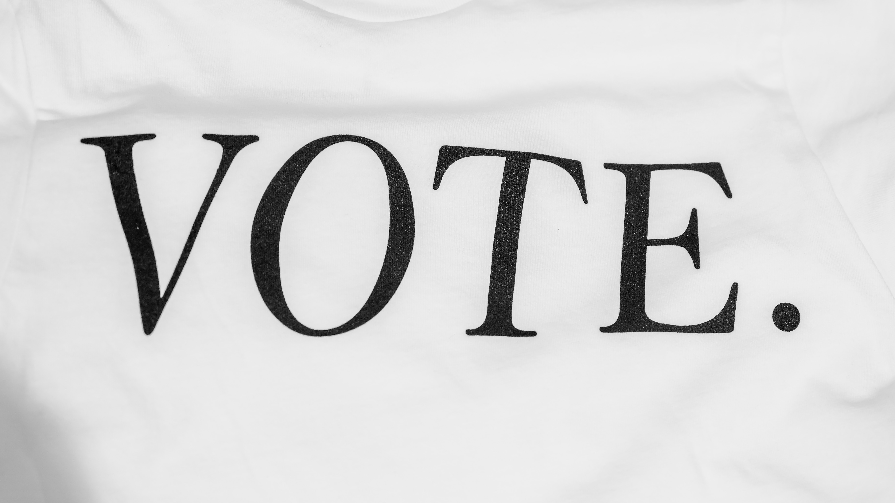

<h4>Voting Methods</h4>

[[Wikipedia](https://en.wikipedia.org/wiki/Voting#Voting_methods)] Voting is a method for a group, such as a meeting or an electorate, in order to make a collective decision or express an opinion usually following discussions, debates or election campaigns. Democracies elect holders of high office by voting. Residents of a place represented by an elected official are called "constituents", and those constituents who cast a ballot for their chosen candidate are called "voters". There are different systems for collecting votes, but while many of the systems used in decision-making can also be used as electoral systems, any which cater for proportional representation can only be used in elections.

- [ ] Voting Criteria
    - Mutual Majority
    - Monotonicity
    - Participation
    - Independence of irrelevant alternatives
    - Later no harm
- [ ] Plurality voting
- [ ] Majority judgement
- [ ] Instant runoff voting
- [ ] Multiple Rounds voting
- [ ] Condorcet Voting
- [ ] Borda count
- [ ] Score voting