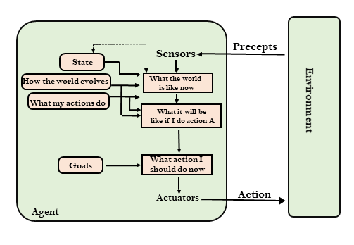
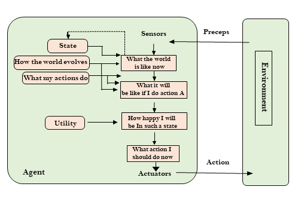

### Types of AI Agents

#### Simple reflex agent

- The Simple reflex agents are the simplest agents. These agents take decisions on the basis of the current percepts and ignore the rest of the percept history.
- These agents only succeed in the fully observable environment.
- The Simple reflex agent does not consider any part of percepts history during their decision and action process.
- The Simple reflex agent works on Condition-action rule, which means it maps the current state to action. Such as a Room Cleaner agent, it works only if there is dirt in the room.
- Problems for the simple reflex agent design approach:
    - They have very limited intelligence
    - They do not have knowledge of non-perceptual parts of the current state
    - Mostly too big to generate and to store.
    - Not adaptive to changes in the environment.

#### Model-based reflex agent

- The Model-based agent can work in a partially observable environment, and track the situation.
- A model-based agent has two important factors:
    - Model: It is knowledge about "how things happen in the world," so it is called a Model-based agent.
    - Internal State: It is a representation of the current state based on percept history.
- These agents have the model, "which is knowledge of the world" and based on the model they perform actions.
- Updating the agent state requires information about:
    - How the world evolves
    - How the agent's action affects the world.
    
#### Goal-based agents

- The knowledge of the current state environment is not always sufficient to decide for an agent to what to do.
- The agent needs to know its goal which describes desirable situations.
- Goal-based agents expand the capabilities of the model-based agent by having the "goal" information.
- They choose an action, so that they can achieve the goal.
- These agents may have to consider a long sequence of possible actions before deciding whether the goal is achieved or not. Such considerations of different scenario are - called searching and planning, which makes an agent proactive.

#### Utility-based agents

- These agents are similar to the goal-based agent but provide an extra component of utility measurement which makes them different by providing a measure of success at a - given state.
- Utility-based agent act based not only goals but also the best way to achieve the goal.
- The Utility-based agent is useful when there are multiple possible alternatives, and an agent has to choose in order to perform the best action.
- The utility function maps each state to a real number to check how efficiently each action achieves the goals.

#### Learning agents

- A learning agent in AI is the type of agent which can learn from its past experiences, or it has learning capabilities.
- It starts to act with basic knowledge and then able to act and adapt automatically through learning.
- A learning agent has mainly four conceptual components, which are:
    - Learning element: It is responsible for making improvements by learning from environment
    - Critic: Learning element takes feedback from critic which describes that how well the agent is doing with respect to a fixed performance standard.
    - Performance element: It is responsible for selecting external action
    - Problem generator: This component is responsible for suggesting actions that will lead to new and informative experiences.
- Hence, learning agents are able to learn, analyze performance, and look for new ways to improve the performance.